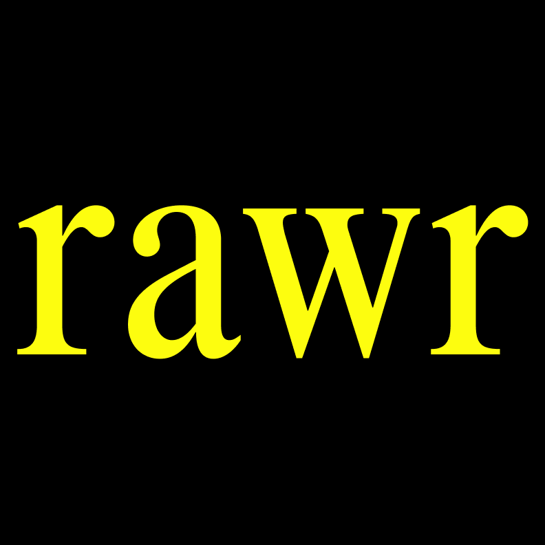

<p align="center">
  
</p>

<h1 align="center">rawr</h1>

<p align="center">
  <em>A magazine built on the taste of one man.</em><br />
  <em>It may be subjective and biased — and that is not denied.</em>
</p>

<p align="center">
  <a href="https://rawr.co.kr"><strong>🌐 rawr.co.kr</strong></a> ·
  <a href="https://www.instagram.com/rawr.co.kr/">📷 Instagram</a>
</p>

<p align="center">
  <a href="https://github.com/lxxjxxki/rawr/actions/workflows/deploy-backend.yml"></a>
  
  
  <a href="https://github.com/lxxjxxki/rawr/stargazers"></a>
</p>

<p align="center">
  
  
  
  
  
  
  
  
</p>

---

## 📖 Table of Contents

- [About](#-about)
- [기술 스택](#%EF%B8%8F-기술-스택)
- [아키텍처](#-아키텍처)
- [주요 기능](#-주요-기능)
- [Project Structure](#-project-structure)
- [Getting Started](#-getting-started)
- [Environment](#-environment)
- [배포](#-배포)
- [Roadmap](#-roadmap)
- [License](#-license)

---

## ✨ About

**rawr**는 한 사람의 취향으로 만들어진 매거진입니다. 빈티지·워크웨어·서브컬처를 중심으로, 과잉된 정보의 시대에 한 개인의 감각이 어디까지 가닿을 수 있는지 실험합니다.

운영 인스타그램의 게시물이 자동으로 사이트 FASHION 카테고리에 동기화되며, 운영자는 admin 페이지에서 글을 보강·관리합니다. 모든 수정과 삭제는 revision/soft-delete로 보호되어 실수로 콘텐츠가 사라지지 않습니다.

---

## ⚙️ 기술 스택

| Layer | Stack |
|---|---|
| **Frontend** | Next.js 14 (App Router), TypeScript, Tailwind CSS, Zustand |
| **Backend** | Spring Boot 3, Spring Security, Spring Data JPA, Flyway, Java 21 |
| **Database** | PostgreSQL 18 (AWS RDS) |
| **Auth** | JWT, OAuth 2.0 (Google, Kakao) |
| **Storage** | AWS S3 (article images) |
| **Hosting** | Vercel (frontend), AWS EC2 (backend) |
| **CI/CD** | GitHub Actions (backend), Vercel (frontend, automatic) |
| **Integrations** | instaloader (Instagram → FASHION), 네이버 스마트스토어 (SHOP) |

---

## 🏗 아키텍처

### 시스템

```
                       ┌─────────────────────────┐
        Browser ──────▶│   Vercel (Next.js SSR)  │
                       └────────────┬────────────┘
                                    │  REST + JWT (Bearer)
                                    ▼
                       ┌─────────────────────────┐
                       │     EC2 (Spring Boot)   │
                       └──┬──────┬──────┬────────┘
                          │      │      │
                          ▼      ▼      ▼
                    ┌────────┐ ┌────┐ ┌──────────────┐
                    │  RDS   │ │ S3 │ │ Google /Kakao│
                    │ (Pg 18)│ │    │ │     OAuth    │
                    └────────┘ └────┘ └──────────────┘

  Daily 04:00 KST cron on EC2:
  instaloader (--fast-update) ──▶ POST /api/articles ──▶ FASHION
  (idempotent via instagramTimestamp; failures → Slack)
```

### 배포 파이프라인

```
git push origin main
       │
       ├─────▶ Vercel        ─▶ rawr.co.kr (자동, 30s~)
       │
       └─────▶ GitHub Actions
                ├─ ./gradlew test
                ├─ ./gradlew bootJar
                ├─ scp app.jar  → EC2:/home/ec2-user/rawr/
                ├─ ssh deploy.sh (Flyway 적용 + JAR 재시작)
                └─ curl health-check  (api.rawr.co.kr)
                                        │
                                        └─▶ ✅  ~1m 30s
```

---

## ✦ 주요 기능

> **Reader**

- 카테고리별 매거진 글 목록과 상세 (Times New Roman MT Condensed × Montserrat 타이포그래피)
- 좋아요 · 북마크
- PostgreSQL ILIKE 풀텍스트 검색
- 본문 안의 `#hashtag`, `@mention`을 인스타그램으로 즉시 점프
- SHOP — 단일 상품 카드, 네이버 스마트스토어 결제로 위임

> **Editor (CONTRIBUTOR / OWNER)**

- 모든 article CRUD (작성, 수정, 카테고리 변경, 발행/비발행)
- **Revision history** — 매 수정 직전 풀 스냅샷이 저장되어, 어떤 시점으로든 되돌릴 수 있음 (revert도 또 하나의 revision이 됨)
- **Soft delete** — 삭제는 휴지통으로, 복원 가능
- 수정/삭제는 본인 글이 아니어도 가능 (협업 모델)

> **Owner only**

- `/admin/users` — 가입자 목록과 role 토글 (READER ↔ CONTRIBUTOR)
- 글 발행/비발행 (publish 권한)

> **Automation**

- 매일 04:00 KST에 `@rawr.co.kr` 게시물 자동 import (instaloader 세션 + 장기 service JWT)
- 실패 시 Slack 알림 (세션 만료, IG 차단, 백엔드 다운 등)
- main 머지 시 백엔드 자동 빌드 → 테스트 → 배포 → 헬스체크 (1분 30초 내외)

---

## 📦 Project Structure

```bash
.
├── rawr-frontend/                      # Next.js application (Vercel)
│   ├── app/
│   │   ├── articles/[slug]/            # 매거진 상세
│   │   ├── [category]/                 # /fashion (다른 슬러그는 /fashion 으로 redirect)
│   │   ├── shop/                       # 스마트스토어 연결 카드
│   │   ├── about/, bookmarks/, mypage/, search/
│   │   └── admin/
│   │       ├── users/                  # OWNER — role 관리
│   │       └── articles/               # editor — CRUD + 휴지통 + 이력
│   ├── components/                     # Header, Sidebar, Footer, LikeButton, AdminGuard, …
│   ├── lib/                            # api 클라이언트, 인증 헬퍼, hashtag/mention linkifier
│   └── store/                          # Zustand stores
│
├── rawr-backend/                       # Spring Boot (EC2)
│   └── src/main/java/com/rawr/
│       ├── article/                    # Article + ArticleRevision + soft delete
│       ├── auth/                       # JWT, OAuth user service
│       ├── user/                       # User, Role
│       ├── admin/                      # Admin user controller
│       ├── like/, bookmark/, comment/  # Engagement (댓글 UI는 보류)
│       ├── subscription/               # 이메일 구독
│       ├── image/                      # S3 업로드
│       └── config/                     # Spring Security, CORS, JwtAuthFilter
│
├── scripts/instagram_import/           # 일일 IG → FASHION cron + service-token issuer
│   ├── import_instagram.py
│   ├── run.sh
│   └── README.md                       # 운영 가이드 (세션 갱신, scp, crontab)
│
├── docs/superpowers/specs/             # 기능 디자인 스펙 (날짜별)
└── .github/workflows/                  # GitHub Actions
    └── deploy-backend.yml
```

---

## 🚀 Getting Started

### Frontend

```bash
cd rawr-frontend
npm install
npm run dev                  # http://localhost:3000
```

### Backend

```bash
cd rawr-backend
./gradlew bootRun            # http://localhost:8081
```

요구 환경: **Java 21** (Temurin) · **Node 18+** · **PostgreSQL 14+**

---

## 🔐 Environment

### `rawr-backend` — `application.yml` 또는 EC2 `.env`

| Key | 설명 |
|---|---|
| `DB_URL` | PostgreSQL JDBC URL (예: `jdbc:postgresql://...:5432/rawr`) |
| `DB_USERNAME` / `DB_PASSWORD` | DB 자격 |
| `RAWR_JWT_SECRET` | JWT 서명용 시크릿 (HS512, 64자 이상 권장) |
| `RAWR_FRONTEND_URL` | CORS allow + OAuth 콜백 베이스 (예: `https://rawr.co.kr`) |
| `GOOGLE_CLIENT_ID` / `GOOGLE_CLIENT_SECRET` | Google OAuth |
| `KAKAO_CLIENT_ID` / `KAKAO_CLIENT_SECRET` | Kakao OAuth |
| `AWS_S3_BUCKET` / `AWS_S3_REGION` | 이미지 업로드 |

### `rawr-frontend/.env.local`

| Key | 설명 |
|---|---|
| `NEXT_PUBLIC_API_URL` | 백엔드 베이스 URL (예: `https://api.rawr.co.kr`) |

### `scripts/instagram_import/` (EC2)

| File | 설명 |
|---|---|
| `session-<USER>` | instaloader 세션 (운영 IG 계정 또는 reader 계정) |
| `service-token.txt` | 1년 유효 OWNER JWT (issue_service_token.py로 발급) |
| `slack-webhook.txt` | 실패 알림 Slack incoming webhook URL |

---

## 🔄 배포

### 자동 (정상 흐름)

- **프론트엔드** — `main` push → Vercel이 즉시 빌드/배포
- **백엔드** — `rawr-backend/**` 변경분이 `main`에 머지되면 GitHub Actions가 자동 처리

### 수동 (긴급 시)

```bash
# 백엔드 수동 배포
./gradlew bootJar
scp -i ~/Downloads/rawr-key.pem build/libs/rawr-backend-*.jar \
    ec2-user@<EC2-IP>:/home/ec2-user/rawr/app.jar
ssh -i ~/Downloads/rawr-key.pem ec2-user@<EC2-IP> 'bash /home/ec2-user/rawr/deploy.sh'
```

---

## 🗺 Roadmap

- [ ] WYSIWYG / rich text 에디터 (현재 raw HTML textarea)
- [ ] 이미지 드래그앤드롭 업로드 UI (현재 S3 URL 직접 붙여넣기)
- [ ] 댓글 UI (백엔드는 완료)
- [ ] AI 고객센터 (`/mypage/support`) — Claude API 기반, 운영자 escalation 포함
- [ ] Instagram Graph API 정식 연동 (operator OAuth 동의 후)
- [ ] Admin "Sync Now" 버튼 (현재 SSH 직접 실행)
- [ ] 본문 이미지 lightbox / lazy loading
- [ ] sitemap.xml · robots.txt · OG 이미지 자동 생성

---

## 📜 License

저작권 © 2026 **rawr**. All rights reserved.

본 저장소의 코드는 학습·참고 목적으로 공개되어 있으며, 매거진 콘텐츠(이미지·캡션·기사 본문)는 별도 저작권의 보호를 받습니다.
